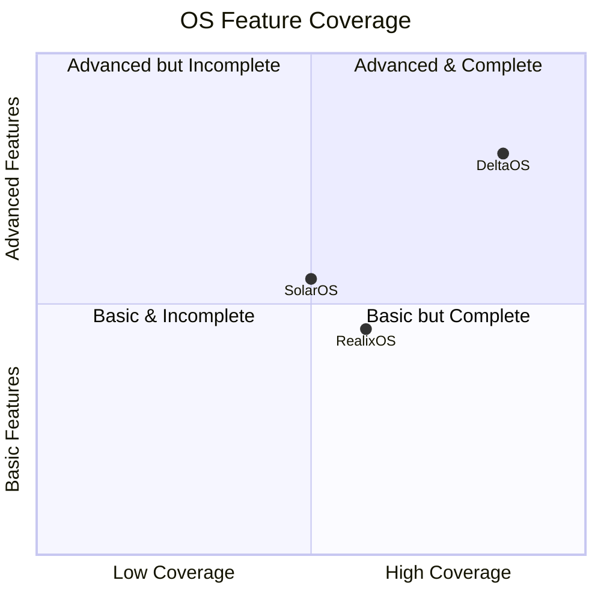

h1 align="center">
  
  <br>
  🖥️ x86_64 Hobby Operating System
</h1>

<p align="center">
  
  
  
  
</p>

<p align="center">
  Preemptive multitasking OS kernel written from scratch in Rust + NASM.<br>
  Round-Robin Scheduler · ACPI/APIC/HPET · VFS/NTFS · Module Loading · VGA Console
</p>

---

## ✨ Features

### 🧠 Process Manager — Round-Robin Scheduler
- **Preemptive multitasking** via timer interrupt (PIT / LAPIC / HPET)
- **Priority-based Round-Robin** — 4 priority levels (Low / Normal / High / RealTime)
- **Foreground / Background / Stopped** process states
- **Signal handling** — SIGKILL, SIGTSTP (Ctrl+Z), SIGCONT
- **Shell commands**: `ps`, `kill`, `run`, `bg`, `fg`
- **Context switch** — cooperative (callee-saved) + preemptive (full register save/iretq)
- **Idle task** — HLT loop at lowest priority

### ⏱️ Timer Subsystem
- **PIT** (8254) — 100 Hz scheduler tick, calibration source
- **HPET** — High Precision Event Timer for nanosecond-resolution uptime
- **LAPIC Timer** — Per-CPU periodic timer with PIT calibration

### 🔌 ACPI + APIC
- **ACPI Parser** — RSDP → RSDT/XSDT → MADT/HPET/FADT
- **Local APIC** — Spurious vector, EOI, IPI (INIT/STARTUP), timer
- **IO APIC** — IRQ routing, interrupt overrides, mask/unmask
- **Legacy PIC fallback** — auto-detected and replaced

### 💾 Memory Management
- **PMM** — Bitmap physical page allocator (4 KB pages, 64 GB addressable)
- **VMM** — 4-level paging (PML4 → PDPT → PD → PT), page flags, identity mapping
- **Slab Allocator** — 10 slab classes (8 B – 4 KB) + bump pointer fallback
- **Kernel heap** — GlobalAlloc implementation for `alloc` crate

### 📁 Virtual File System
- **VFS** — Mount points, file descriptors, inode abstraction
- **NTFS** — BPB parser, MFT records, attribute traversal, data runs, journaling
- **RamFS / ProcFS** — stubs ready for implementation

### 📦 Module Manager
- Runtime **load / init / unload** of kernel modules
- **Symbol table** — kernel API exported to modules
- **Dependency resolution** — refuses init if deps not running
- **Ramdisk** support for bundled modules

### 🛡️ Architecture
- **GDT** — Null / Kernel Code / Kernel Data / User Code / User Data / TSS
- **IDT** — 256 entries: CPU exceptions, hardware IRQs, syscall gate (int 0x80), APIC spurious
- **TSS** — Kernel stack for privilege escalation (Ring 3 → Ring 0)
- **Syscalls** — Read/Write/Open/Close/Exit/Getpid/Yield/Mmap/Munmap/Print

### ⌨️ I/O
- **VGA Text Mode** — 80×25 color console at 0xB8000
- **Keyboard** — PS/2 scancode → ASCII with Shift/CapsLock
- **Serial** — QEMU stdio output via COM1
- **AHCI** — SATA driver stub
- **Port I/O** — `inb`/`outb`/`inl`/`outl` wrappers

### 🚀 Boot
- **MBR bootloader** — 16-bit real mode → 32-bit protected → 64-bit long mode
- **Multiboot2** — GRUB-compatible entry point
- **QEMU ready** — run scripts for `-kernel`, ISO, and disk image modes

---


## 📁 Project Structure

```
DeltaOS/
├── boot/
│   ├── boot.asm            # Multiboot2 entry + GDT + long mode switch
│   ├── long_mode.asm       # 64-bit long mode setup
│   └── mbr.asm             # MBR bootloader (raw 16-bit)
├── src/
│   ├── lib.rs              # Kernel main + global state + kprint!/kprintln!
│   ├── interrupts.rs       # ISR handler + keyboard + timer tick
│   ├── syscall.rs          # int 0x80 syscall dispatch
│   ├── arch/
│   │   ├── gdt.rs          # GDT + TSS setup (7 entries)
│   │   └── idt.rs          # IDT setup (256 vectors)
│   ├── sched/
│   │   ├── scheduler.rs    # Round-Robin preemptive scheduler
│   │   ├── task.rs         # Task struct + signals + stack setup
│   │   └── context_switch.asm  # Cooperative + preemptive ASM switch
│   ├── timer/
│   │   └── mod.rs          # PIT + HPET driver
│   ├── acpi/
│   │   └── mod.rs          # RSDP/RSDT/XSDT/MADT/HPET/FADT parser
│   ├── apic/
│   │   └── mod.rs          # Local APIC + IO APIC driver
│   ├── memory/
│   │   ├── pmm.rs          # Physical memory manager (bitmap)
│   │   ├── vmm.rs          # Virtual memory manager (4-level paging)
│   │   └── heap.rs         # Slab + bump allocator
│   ├── fs/
│   │   ├── vfs.rs          # Virtual file system + inode trait
│   │   └── ntfs.rs         # NTFS volume driver + MFT parser
│   ├── module/
│   │   └── manager.rs      # Module load/init/unload + symbol table
│   └── drivers/
│       └── mod.rs          # Driver stubs
├── user/
│   ├── shell.cpp           # Userspace shell (C++ stub)
│   ├── init.cpp            # Init process
│   └── cpp_std.cpp         # Minimal C++ runtime
├── qemu/                   # QEMU run scripts
├── Cargo.toml              # Rust kernel crate
├── linker.ld               # Kernel linker script
├── build.rs                # Cargo build script
├── build.sh                # Full build pipeline
├── build_img.py            # Disk image builder
├── x86_64-deltaos.json     # Custom Rust target
└── Makefile                # GNU Make build
```

---

## 🚀 Quick Start

### Prerequisites

```bash
# Rust nightly + source
rustup toolchain install nightly
rustup component add rust-src --toolchain nightly

# NASM assembler
sudo apt install nasm

# QEMU
sudo apt install qemu-system-x86

# Linker (lld)
sudo apt install lld
```

### Build & Run

```bash
# Clone
git clone https://github.com/yourname/DeltaOS.git
cd DeltaOS

# Build everything
make all

# Run with QEMU (multiboot2)
make run

# Or build ISO and run
make iso
make run-iso
```

### Alternative: build.sh

```bash
chmod +x build.sh
./build.sh

# Run
./qemu/run.sh
```

---

## 📊 Comparison: DeltaOS vs SolarOS vs RealixOS



| Feature | DeltaOS | SolarOS | RealixOS |
|:---|:---:|:---:|:---:|
| **Preemptive Multitasking** | ✅ Round-Robin + Priority | ❌ Cooperative only | ⚠️ Basic round-robin |
| **ACPI Parser** | ✅ RSDP→RSDT/XSDT→MADT/HPET/FADT | ❌ None | ⚠️ Partial RSDP only |
| **Local APIC** | ✅ Full (timer, EOI, IPI, spurious) | ❌ Legacy PIC only | ⚠️ Basic EOI |
| **IO APIC** | ✅ IRQ routing + overrides | ❌ None | ❌ None |
| **HPET Timer** | ✅ Periodic + uptime + calibration | ❌ None | ❌ None |
| **PIT Timer** | ✅ 100 Hz scheduler + calibration | ✅ Basic tick | ✅ Basic tick |
| **Process Signals** | ✅ SIGKILL/SIGTSTP/SIGCONT | ❌ None | ❌ None |
| **FG/BG Process Mgmt** | ✅ `fg`/`bg`/`ps`/`kill`/`run` | ❌ None | ⚠️ `ps` only |
| **Context Switch (ASM)** | ✅ Cooperative + Preemptive (iretq) | ⚠️ Cooperative only | ⚠️ Cooperative only |
| **VFS** | ✅ Mount points + FDs + inodes | ❌ Flat file I/O | ⚠️ Basic open/read |
| **NTFS** | ✅ BPB + MFT + Attributes + Runs | ❌ None | ❌ None |
| **Module Loading** | ✅ Load/Init/Unload + deps + symbols | ❌ None | ❌ None |
| **PMM (Bitmap)** | ✅ 64 GB / 4 KB pages / reserve | ⚠️ Simple bitmap | ⚠️ Simple bitmap |
| **VMM (4-level Paging)** | ✅ Map/Unmap/Translate/Flags | ⚠️ Identity map only | ⚠️ Identity map only |
| **Slab Heap** | ✅ 10 classes + bump fallback | ⚠️ Bump only | ⚠️ Bump only |
| **GDT + TSS** | ✅ 7 entries + kernel stack RSP0 | ✅ Basic | ✅ Basic |
| **IDT** | ✅ 256 vectors + dedicated timer ISR | ⚠️ 32 entries | ⚠️ 48 entries |
| **Syscalls (int 0x80)** | ✅ 19 syscalls | ❌ None | ⚠️ 3-4 basic |
| **VGA Text Console** | ✅ 80×25 color | ✅ Monochrome | ✅ Monochrome |
| **Keyboard (PS/2)** | ✅ Full ASCII + Shift + CapsLock | ⚠️ Basic scancodes | ⚠️ Basic scancodes |
| **Language** |  Rust + NASM | C + ASM | C + ASM |
| **Memory Safety** | ✅ Rust borrow checker | ❌ Manual | ❌ Manual |
| **x86_64** | ✅ Native 64-bit | ⚠️ 32-bit | ✅ 64-bit |

---

## 🧪 Shell Commands

| Command | Description |
|:---|:---|
| `ps` | List all processes with PID, state, priority, FG/BG |
| `kill <pid>` | Terminate a process (SIGKILL) |
| `run <name>` | Create and start a new process |
| `bg <pid>` | Resume a stopped process in background |
| `fg <pid>` | Move a background process to foreground |
| `help` | Show available commands |
| `clear` | Clear VGA screen |
| `uptime` | Show system uptime |
| `meminfo` | Show memory statistics |
| `reboot` | Reboot the system |

---

## 🔧 Kernel API

### Syscalls (int 0x80)

| # | Name | Args | Description |
|:---|:---|:---|:---|
| 0 | `read` | fd, buf, count | Read from file descriptor |
| 1 | `write` | fd, buf, count | Write to file descriptor |
| 2 | `open` | path, flags | Open a file |
| 3 | `close` | fd | Close file descriptor |
| 4 | `seek` | fd, offset | Seek in file descriptor |
| 5 | `stat` | path, buf | Get file status |
| 6 | `mkdir` | path, mode | Create directory |
| 7 | `unlink` | path | Remove file |
| 8 | `getdents` | fd, buf, count | Read directory entries |
| 10 | `mount` | src, tgt, fs_type | Mount filesystem |
| 11 | `umount` | tgt | Unmount filesystem |
| 20 | `clone` | — | Fork current process |
| 21 | `exit` | code | Terminate process |
| 22 | `waitpid` | pid | Wait for child |
| 23 | `getpid` | — | Get current PID |
| 24 | `yield` | — | Yield CPU time slice |
| 30 | `mmap` | addr, size | Map memory region |
| 31 | `munmap` | addr, size | Unmap memory region |
| 100 | `print` | buf, len | Print to VGA console |
| 101 | `readline` | buf, len | Read line from keyboard |
| 200 | `sysinfo` | — | Get system information |

---

## 🛠️ Build Targets

| Target | Output | Description |
|:---|:---|:---|
| `make all` | `build/deltaos.elf` | Full build |
| `make iso` | `build/deltaos.iso` | Bootable ISO (GRUB) |
| `make run` | — | QEMU multiboot2 |
| `make run-iso` | — | QEMU from ISO |
| `make debug` | — | QEMU + GDB on :1234 |
| `make clean` | — | Remove build artifacts |

---

##  Known Limitations

- Single-core only (SMP not yet implemented)
- No user mode (Ring 3) — all tasks run in kernel mode
- No disk I/O — AHCI/SATA driver is a stub
- No network stack
- NTFS driver is read-only with no real disk backend
- No swap / demand paging

---

##  License

MIT License — use, modify, and distribute freely.

---

<p align="center">
  Built with 🦀 Rust, ☕ Coffee, and a lot of <code>unsafe</code>
</p>
